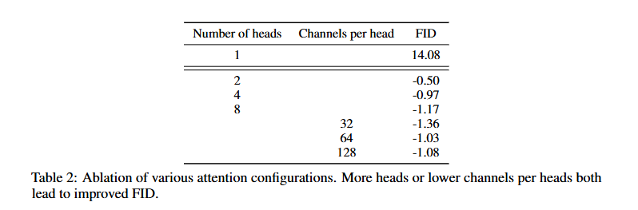
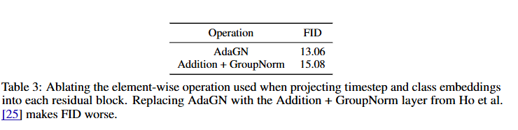
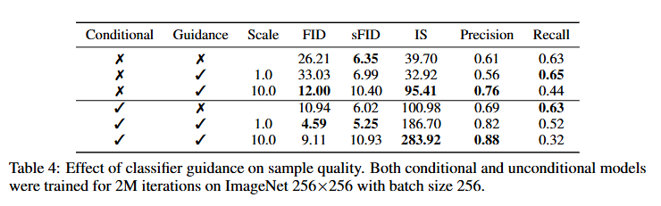
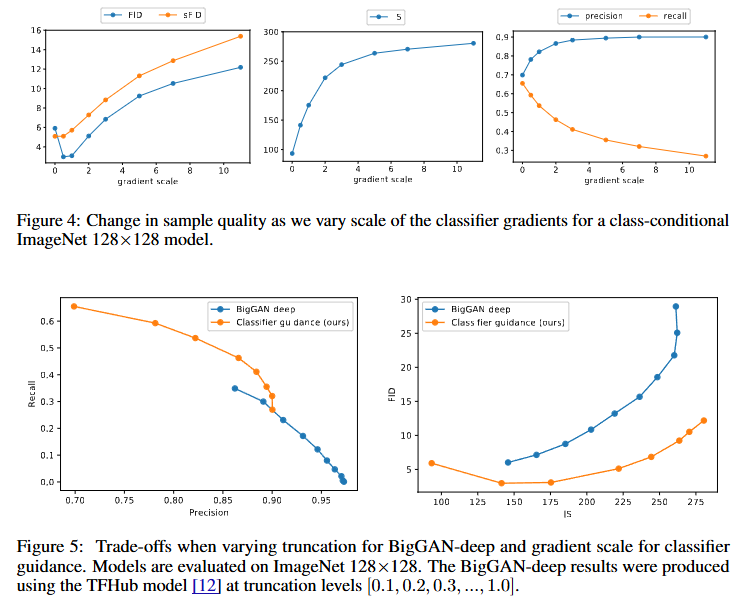
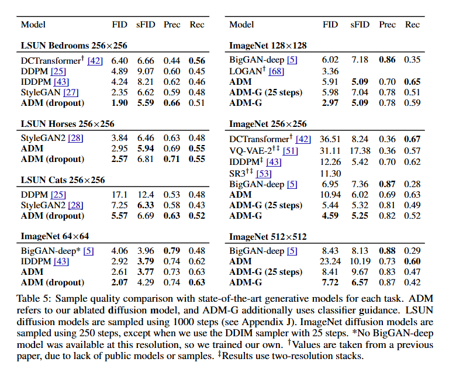

# Diffusion Models Beat GANs on Image Synthesis

This is an implementation of [Diffusion Models Beat GANs on Image Synthesis](https://arxiv.org/pdf/2105.05233).

## Key Assumptions

- Loss function: $\mathcal{L} = \mathcal{L}_{\text{simple}} + \lambda\mathcal{L}_{\text{VLB}}$ as proposed in "Improved Denoising Diffusion Probabilistic Models"
- DDIM sampling used for <50 steps as proposed in "Denoising Diffusion Implicit Models"

## Architecture Improvements

- Increased depth vs width while maintaining model size
- Increased number of attention heads
- Extended attention to multiple resolutions (32×32, 16×16, 8×8) 
- Adopted BigGAN residual blocks for up/downsampling activations [60]
- Rescaled residual connections with 1/√2 [60, 27, 28]

## Main Idea

During sampling, we generate an image conditioned on a desired class label $y$, using both the diffusion model and a separately trained classifier. Here's how it works step-by-step:

### 🧪 Sampling Procedure

#### 1. Initialize with Pure Noise
Begin with a random noise sample:

$x_T \sim \mathcal{N}(0,I)$

This corresponds to the final step of the diffusion process (maximum noise).

#### 2. Iterate Backwards Through Time
For each timestep $t=T \rightarrow 1$:

##### a) Predict Noise (or Denoised Image)
Use the diffusion model to estimate the noise added at step $t$, or the denoised image:

$\epsilon_\theta(x_t,t)$ or $\hat{x}_0$

##### b) Compute Classifier Gradient
Evaluate the gradient of the classifier's log-probability with respect to the input:

$g = \nabla_{x_t} \log p_\phi(y|x_t)$

This gradient tells us how to modify the image to make it more likely to belong to class $y$.

##### c) Adjust the Noise Prediction (Guidance Step)
Incorporate classifier guidance by modifying the predicted noise:

$\tilde{\epsilon} = \epsilon_\theta(x_t,t) - s \cdot g$

where $s$ is the guidance scale (a tunable hyperparameter controlling the strength of conditioning).

##### d) Sample the Next Image
Use the modified noise $\tilde{\epsilon}$ in the DDPM update rule to obtain $x_{t-1}$.

#### 3. Repeat Until $t=0$
After iterating through all timesteps, you obtain a final, fully denoised image that is strongly aligned with the target class $y$.

### ⚠️ Important Notes

- Higher guidance scale $s$ leads to more accurate class alignment, but may reduce diversity or introduce artifacts
- This method allows for flexible, post hoc conditioning without retraining the diffusion model
- The process can be adapted for classifier-free guidance as an alternative approach

## ADM Module Overview
The `adm` module provides a suite of diffusion-based generative components and classifiers following Dhariwal & Nichol (2021). It includes:
- **ADM**: Core UNet‑based diffusion model (`UNetModel`) for image synthesis.
- **ADM_classifier**: A separately trained UNet classifier used to compute gradients for classifier-guided sampling.
- **ADM_U**: Diffusion model specialized for super‑resolution and upscaling tasks.
- **ADM_G**: Wrapper that combines `ADM` and `ADM_classifier` to perform guided sampling in a single call.

## Out-of-the-Box Models

### Diffusion Models
- ADM_diffusion_64_conditioned      – 64×64 conditional diffusion model (with classifier guidance)  
- ADM_diffusion_64_unconditioned    – 64×64 unconditional diffusion model  
- ADM_diffusion_128_conditioned     – 128×128 conditional diffusion model  
- ADM_diffusion_128_unconditioned   – 128×128 unconditional diffusion model  
- ADM_diffusion_256_conditioned     – 256×256 conditional diffusion model  
- ADM_diffusion_256_unconditioned   – 256×256 unconditional diffusion model  
- ADM_diffusion_512_conditioned     – 512×512 conditional diffusion model  
- ADM_diffusion_512_unconditioned   – 512×512 unconditional diffusion model  

### Classifier Models
- ADM_classifier_64   – Classifier for 64×64 images  
- ADM_classifier_128  – Classifier for 128×128 images  
- ADM_classifier_256  – Classifier for 256×256 images  
- ADM_classifier_512  – Classifier for 512×512 images  

### Upscaling & Guidance
- ADM_U  – Pretrained diffusion-based upscaling model (super‑resolution)  
- ADM_G  – Guidance wrapper orchestrating classifier‑guided sampling  

## Model Analysis & Results

### Attention Configuration

### Architecture Performance

### Normalization

### Conditioning & Guidance

### Guidance Scaling Impact

### Benchmark Comparison

## Citation
> **Diffusion Models Beat GANs on Image Synthesis**  
> *Prafulla Dhariwal, Alexander Quinn Nichol*  
> arXiv 2021  
> [[Paper]](https://arxiv.org/abs/2105.05233)
